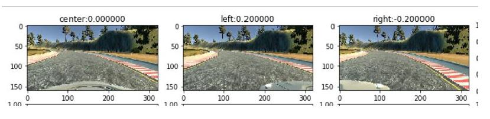
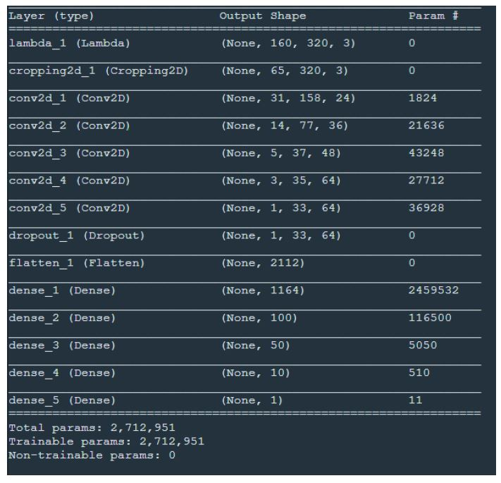

# Behavioral-Cloning-for-Autonomous-Driving

## The goals / steps of this project are the following:

 Use the simulator to collect data of good driving behavior

 Build, a convolution neural network in Kera’s that predicts steering angles from images

 Train and validate the model with a training and validation set

 Test that the model successfully drives around track one without leaving the road

 Summarize the results with a written report

## Files Included:

 model.py containing the script to create and train the model

 drive.py for driving the car in autonomous mode

 model.h5 containing a trained convolution neural network

 writeup_report.pdf

## Model Architecture 

 CNN built using NVIDIA's model as baseline 

 Modifications include :- 

o Usage of ELU instead of RELU activation as it can produce negative outputs 

o Cropping of image to isolate only the road portion 

o Dropout before flattening to avoid overfitting

## Loading and Augmentation 

The dataset provided as the sample was used. The images were adjusted based on if they were center, left, or right images. 

Center images have a steering angle of 0 so flipping or angle adjustment is not required. 

Left and images have steering angles so flipping and angle adjustment of +0.2 for Left and -0.2 for Right images is required to avoid vehicle from going off track.

The additional data generated was stored in a dictionary generated_data. The aug_data function was used to make the adjustments. 
Finally, after iterating through every row in the driving log file the images were stored in a NumPy array X and the steering angles were stored in a NumPy array y. 

## Training the Model:

Using X and y as inputs with a 70-30 train test split the model was trained. 

The model consists of the following layers:

Normalized Input Layer 

Cropping Layer to select only required portion from image 

5 Convolutional Layers with ELU activation as it gives negative outputs as well 

A dropout layer to avoid overfitting model to training set data; Dropout value used is 0.5

4 Fully Connected Layers following Nvidia’s model with 1164,100,50 and 10 neurons in each layer.

1 Output Layer 

## Parameter Tuning: 

The model was compiled using the following parameters:- 

MSE for loss as it is ideal for regression problems 

Adam Optimizer 

Learning Rate=1e-3 

Accuracy for metrics

##Final Architecture

Finally, it was fitted on X and y (images and corresponding angles) for 5 epochs. 
Using drive.py and model.h5 the autonomous mode was tested and recorded as video.mp4.

